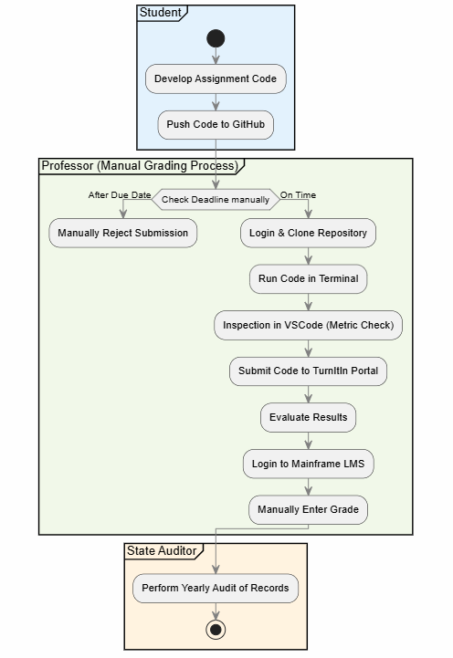
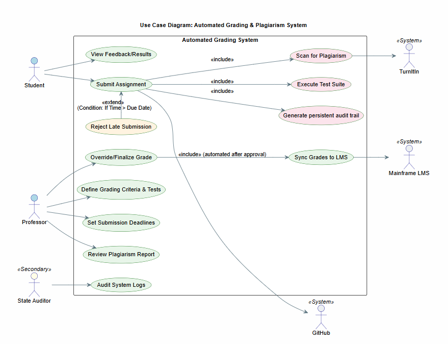

# Implementation Plan for Automated Programming Assignment Grading System

**Prepared for:** University SWE Department  
**Subject:** Practical 2 - Architecture Kata  

---

## 1. Requirements Analysis

### Problem 
The current grading process is fully manual, requiring professors to clone, run, and evaluate each student’s code via terminal and VSCode. With over 300 students, this approach is unscalable and prone to human error. Critically, there is currently **no automated plagiarism detection** or persistent system to support the mandatory yearly state audits.

### Key Needs (Functional)
To address these challenges, the system supports:
* **Automated Execution:** Students upload source code which is automatically run and graded.
* **Unlimited Attempts:** Students can submit multiple times to improve their grade.
* **Plagiarism Detection:** Integrated comparison between student submissions and external web services like TurnItIn.
* **LMS Integration:** Automated grade transfer to the University’s legacy system.
* **Deadline Enforcement:** Automated rejection of submissions after the professor’s set date/time.

### Constraints
* **Legacy Infrastructure:** The University LMS is mainframe-based and "difficult to change," requiring a non-invasive integration strategy.
* **Budgetary Limits:** Zero budget for new high-end IT infrastructure (due to SportsBall stadium construction) necessitates using free/existing tools like GitHub.
* **Regulatory Compliance:** Grades must be persistent and auditable for the state-based regulatory body.

---

## 2. Architectural Design

The system follows an **Event-Driven Architecture** to ensure efficiency and low operational costs.

### Key Design Decisions 

#### GitHub Webhook Integration
Instead of manual cloning, the system uses **Webhooks**. When a student pushes code to their repository, GitHub sends a real-time signal to our system. This triggers the grading pipeline automatically, satisfying the "unlimited attempts" requirement without increasing faculty workload.

#### Containerized Code Execution (Sandboxing)
To maintain the University's high SWE standards, code is run in isolated **Docker-style containers**. This allows the system to calculate specific metrics and run test suites safely, preventing student code from crashing the main server.

#### Mainframe Data Adapter
To solve the "Difficult to Change" Mainframe constraint, we use a **Middleware Adapter**. Instead of a direct API (which the mainframe lacks), our system generates a validated batch file (CSV/XML) that the Mainframe consumes daily. This fulfills Requirement 4 while respecting the legacy hardware limitations.

---

## 3. Quality Attributes Consideration

### Auditability (Regulatory Compliance)
Every "Run" and "Grade" is stored in a persistent SQL database with a full version history. This ensures that when the **state-based regulatory body** audits the university, we can provide a complete trail of every student attempt, not just the final mark.

### Scalability & Availability
The system uses a queue-based approach to handle 300+ students. If 100 students submit at the deadline, the system queues the tasks, ensuring no submissions are lost and the "Due Date" check (Req 5) is applied the moment the push is received.

### Security & Integrity
By integrating **TurnItIn** via API, the system ensures academic integrity. The "Sandbox" execution environment provides security by ensuring student code cannot access the university's internal network or other students' data.

---

## 4. Interaction Overview Diagram (IoD) - Actor-to-Actor

This diagram highlights the current manual bottlenecks, specifically the time wasted by professors cloning repositories and manually uploading files to TurnItIn. It establishes the "Business Outcome" first: moving from raw code to a verified grade.

---

## 5. Use Case Diagram (UCD)

This diagram defines the system boundary. It shows how the **Student** and **Professor** trigger automated processes (Tests, Plagiarism, Sync) that interact with external systems like the **Mainframe LMS**, **GitHub**, and **TurnItIn**.

---

## 6. Interaction Overview Diagram (IoD) - System Supported

This shows the "Future State." The system acts as the orchestrator, automatically checking the deadline, running tests, and checking plagiarism before persisting the data for the **State Auditor** to achieve the business outcome with minimal manual intervention.

---

## 7. Reflection

The "SportsBall Stadium" constraint was a significant driver for this architecture. It forced a shift away from expensive custom software toward a **lean, integration-focused design**. 

I learned that in high-performing SWE environments, the goal of automation isn't just speed; it's **Auditability**. Without the automated logs, the University would risk its accreditation during state audits. By using GitHub as the primary interface, we provide a modern experience for students while keeping costs low enough to satisfy the University's budget constraints.

---

## 8. References

1. **GeeksforGeeks.** *Interaction Overview Diagrams in UML.* Available at: https://www.geeksforgeeks.org/interaction-overview-diagrams-unified-modeling-language-uml/
2. **Visual Paradigm.** *What is Interaction Overview Diagram?* Available at: https://www.visual-paradigm.com/guide/uml-unified-modeling-language/what-is-interaction-overview-diagram/
3. **GeeksforGeeks.** *Use Case Diagram.* Available at: https://www.geeksforgeeks.org/use-case-diagram/
4. **Fowler, M.** *Event-Driven Architecture.* Available at: https://martinfowler.com/articles/201701-event-driven.html

---

## AI Assistance
Link: https://gemini.google.com/share/03dbd64e35e4

This report and the associated system design were developed with the assistance of Gemini (Google AI) to support the structuring of UML logic and refinement of architectural concepts.