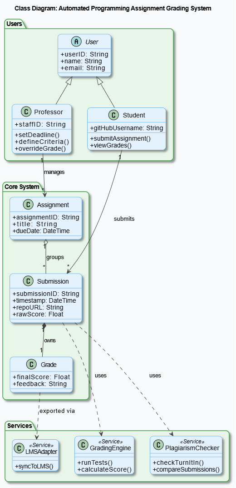
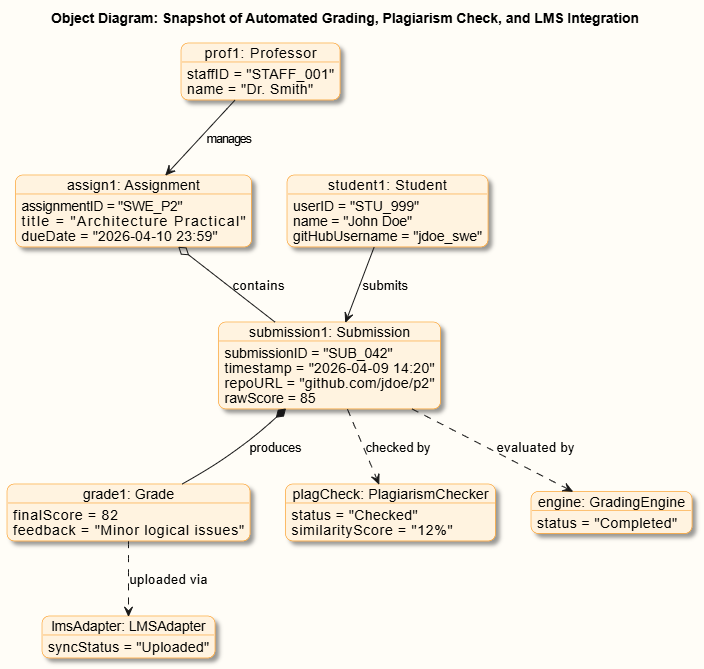

# Project Implementation: Automated Grading System (Practical 3)

**Prepared for:** University Software Engineering Department  

---

## 1. Introduction

Building on our previous design work, this practical shifts the focus from the "what" to the "how." While our earlier phase mapped out how users interact with the system, this stage dives into the internal architecture. We are essentially pulling back the curtain to look at the engine room, using **Class** and **Object Diagrams** to define how the system is organized and how its components communicate.

---

## 2. Structural Blueprint: The Class Diagram

### Overview
The Class Diagram serves as the system's static blueprint. It defines the "DNA" of the software—detailing the core classes, the data they hold (attributes), the actions they perform (methods), and how they are linked together.

Organized the architecture into three functional layers:
* **User Management:** Handles **Students** and **Professors**, both of whom share a foundation in a base **User** class.
* **Core:** The heart of the system, involving **Assignments**, **Submissions**, and **Grades**.
* **Service Layer:** Logic-heavy components like the **GradingEngine**, **PlagiarismChecker**, and **LMSAdapter**.

### Breakdown of Logic & Relationships
* **Inheritance:** We use a "Generalization" approach where Student and Professor classes inherit shared traits from the User class to keep the code clean.
* **Association:** This defines simple links—like a Professor managing multiple assignments or a Student submitting their work.
* **Aggregation:** This shows a "part-of" relationship. An Assignment acts as a container for many Submissions, though the submissions maintain their own identity.
* **Composition:** A much tighter bond. A **Grade** is "owned" by a **Submission**; if you delete the submission, the grade ceases to exist.
* **Dependency:** These are temporary "as-needed" relationships. For example, the system only calls upon the **PlagiarismChecker** or **LMSAdapter** during specific processing phases.

> **Design Note:** By separating the core data (the grades) from the processing logic (the engines), the system becomes much easier to update or scale without breaking the entire foundation.

---

## 3. Real-Time Snapshot: The Object Diagram

### Overview
If the Class Diagram is the blueprint, the Object Diagram is a **snapshot of the system in action**. It shows a specific moment in time—like a "freeze-frame" of a student turning in code and the system reacting.

**What we’re seeing in this snapshot:**
* An active Professor overseeing a specific assignment.
* A Student in the act of submitting their code.
* The **GradingEngine** actively calculating a score.
* The **PlagiarismChecker** scanning for originality.
* A **Grade** being generated and funneled back to the LMS.

### Key Takeaways
* It proves the Class Diagram works by showing how actual instances of those classes behave together.
* It maps out the "data flow"—tracing the path from a raw code file to a final grade.
* It highlights the difference between theoretical structure (classes) and real-world execution (objects).

---

## 4. Key Design Principles

* **Modularity:** By breaking the system into distinct services, we can fix the grading logic without touching the user login code.
* **Reusability:** The **GradingEngine** isn't built for just one task; it’s designed to be used across any number of different assignments.
* **Scalability:** The architecture is "wide" enough to handle hundreds of simultaneous submissions without bottlenecks.
* **Integration:** Thanks to the **LMSAdapter**, the system can "speak the same language" as existing university software, making deployment much smoother.

---

## 5. Personal Reflection

This practical provided a deep dive into the internal mechanics of software design. Moving from user-facing requirements to internal modeling forced me to think about how data actually moves through a system. 

One of the biggest hurdles was getting the "flavor" of the relationships right, specifically distinguishing between **aggregation** (loose collections) and **composition** (strict ownership). Understanding these nuances is what separates a basic sketch from a professional engineering document.

Ultimately, seeing the Class and Object diagrams side-by-side helped bridge the gap between abstract code and functional reality. It’s one thing to say "the system grades code," and another to map out every object that makes that happen.
